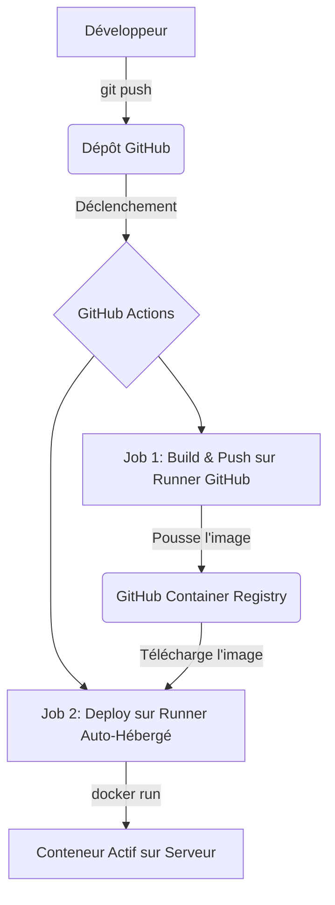

# Service Node.js Conteneurisé avec Déploiement CI/CD

Ce projet a pour but de démontrer le cycle de vie complet d'une application web, de sa création en Node.js à son déploiement automatisé sur un serveur via un pipeline CI/CD avec Docker et GitHub Actions.

[](https://github.com/Filip-Alves/dockerized-service-deployment/actions)


## 🚀 Fonctionnalités Clés

*   **Service Web Node.js :** Un serveur simple construit avec Express.js.
*   **Deux Routes :**
    *   `/` : Une route publique qui retourne `Hello, world!`.
    *   `/secret` : Une route protégée qui nécessite une authentification.
*   **Sécurité :** La route `/secret` est protégée par une authentification `Basic Auth`.
*   **Configuration centralisée :** L'application est entièrement configurable via des variables d'environnement.

## 🛠️ Stack Technique

*   **Backend :** Node.js, Express.js
*   **DevOps :** Docker, GitHub Actions (CI/CD)
*   **Registre de Conteneurs :** GitHub Container Registry (GHCR)
*   **Infrastructure de Déploiement :** Runner GitHub Auto-hébergé (Self-Hosted) sur un environnement Linux (WSL2).

## 🏗️ Architecture du Pipeline CI/CD

Ce projet utilise un pipeline de déploiement automatisé qui se déclenche à chaque `push` sur la branche `main`. Voici le flux de travail :

1.  **`git push`** : Le développeur pousse une nouvelle version du code sur GitHub.
2.  **Déclenchement du Workflow** : GitHub Actions détecte le changement et lance le workflow `deploy.yml`.
3.  **Job 1 : `build-and-push`**
    *   S'exécute sur un runner hébergé par GitHub (`ubuntu-latest`).
    *   Construit l'image Docker de l'application.
    *   Pousse l'image versionnée sur le GitHub Container Registry (GHCR).
4.  **Job 2 : `deploy`**
    *   S'exécute sur le **runner auto-hébergé** (`self-hosted`) configuré sur le serveur de destination.
    *   Se connecte à GHCR et télécharge la nouvelle image Docker.
    *   Arrête et supprime l'ancien conteneur de l'application.
    *   Démarre un nouveau conteneur avec l'image fraîchement téléchargée et les secrets de l'application.



## ⚙️ Installation et Lancement

Pour exécuter ce projet, vous aurez besoin de Git, Node.js et Docker installés sur votre machine.

**1. Cloner le dépôt**
```bash
git clone https://github.com/VOTRE_NOM_UTILISATEUR/NOM_DE_VOTRE_REPO.git
cd NOM_DE_VOTRE_REPO
```

**2. Configurer les variables d'environnement**
Créez un fichier `.env` à la racine du projet. Vous pouvez copier le fichier d'exemple :
```bash
cp .env.example .env
```
Modifiez ensuite le fichier `.env` avec vos propres valeurs :
```
# .env
APP_SECRET_MESSAGE="Mon message secret pour le déploiement !"
APP_USERNAME=admin
APP_PASSWORD=unmotdepassesecurise
```

**3. Lancer l'application**

*   **Option A : Lancement local (sans Docker)**
    ```bash
    # Installer les dépendances
    npm install

    # Démarrer le serveur
    node index.js
    ```

*   **Option B : Lancement avec Docker (Recommandé)**
    ```bash
    # Construire l'image Docker
    docker build -t node-service .

    # Lancer un conteneur à partir de l'image
    docker run --env-file .env -p 3000:3000 node-service
    ```

Une fois démarré, le service sera accessible à l'adresse `http://localhost:3000`.

## 🧠 Compétences Acquises

Ce projet m'a permis de maîtriser les compétences fondamentales du cycle de vie logiciel moderne :
*   **Création d'API Backend :** Développement d'un service web fonctionnel et sécurisé avec Node.js.
*   **Conteneurisation d'Applications :** Isolation et packaging d'une application avec Docker pour garantir la portabilité et la reproductibilité.
*   **Mise en place d'un Pipeline CI/CD :** Automatisation complète du processus de déploiement, de la mise à jour du code à la mise en production, avec GitHub Actions.
*   **Gestion des Secrets :** Utilisation des bonnes pratiques pour gérer les informations sensibles (clés d'API, mots de passe) dans un environnement automatisé.
*   **Infrastructure et Déploiement :** Configuration d'un environnement serveur et déploiement d'une application conteneurisée en utilisant un runner auto-hébergé, une technique avancée et puissante.
